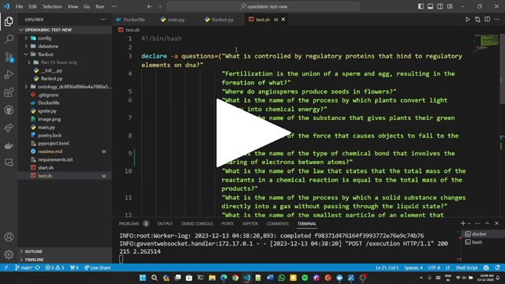

# Flanbot - A Transformer based Chatbot to answer Science Questions 

## Introduction
The task is to forge an 💬NLP chatbot that doesn’t just answer, but masters science-related questions.

## Model Selection: Why flan-t5-base?

I chose `flan-t5-base` model for creating the chatbot due to several reasons:

1. **Versatility**: It is a versatile model that can handle a variety of NLP tasks. It can be used for text summarization, translation, classification, and question answering. This makes it a good choice for our task, which is to answer science-related questions.

2. **Pre-training**: `flan-t5-base` is pre-trained on a large corpus of text, which gives it a good understanding of language semantics and syntax.

3. **Fine-tuning capabilities**: it can be fine-tuned on a specific task or domain. In our case, we can fine-tune it on a dataset of science-related questions and answers to make it a master in this domain.

4. **Performance**: `flan-t5-base` has shown excellent performance in various NLP benchmarks, which gives us confidence in its ability to handle our task effectively.

5. **Efficient**: `flan-t5-base` has a relatively smaller footprint (`250M` parameters) compared to other large language models (`>1B` parameters), making it more accessible for deployment on various platforms and devices. 
It can be inferenced on a `CPU` or a `Consumer grade GPU` without any issues.  

1. **Scalable**: `flan-t5` is avaliable in various sizes, ranging from `flan-t5-small` to `flan-t5-xxl`.  
This scalability ensures smooth performance even with resource constraints, making it suitable for real-world chatbot applications.  
Bigger variants can be used for more complex tasks after fine-tuning on a specific domain.


## Model Training

### Dataset
- The model was trained on the `SciQ` dataset, which contains science-related questions and answers.  
- The SciQ dataset contains 13,679 crowdsourced science exam questions about Physics, Chemistry and Biology, among others.  
- The dataset was downloaded from [`Kaggle`](https://www.kaggle.com/datasets/thedevastator/sciq-a-dataset-for-science-question-answering) or from [`Huggingface`](https://huggingface.co/datasets/sciq).

### Training

- The model was trained on a `Nvidia Tesla T4` GPU with `16GB` of VRAM on `Google Colab Free Tier`.

- The notebook used for training is available [`here`](https://colab.research.google.com/drive/1BPtCo_BbPbMpgwF77pzrmKY2zIRzlEqg?usp=sharing) in the repository.

- The model was finetuned with:
  - `batch size`: 8
  - `learning rate`:3e-4
  - `epochs`: 3
  
- Then further finetuned with:
  - `batch size`:32
  - `learning rate`:3e-4
  - `epochs`: 1

- Final Training results:
  - `training loss`: 1.3092
  - `validation loss`: 0.9788
  - `ROUGE-1`: 0.4977
  - `ROUGE-2`: 0.1207
  - `ROUGE-L`: 0.4972
  - `ROUGE LSUM`: 0.4968


- This fine-tuned model `flan-t5-base-sciq` has been uploaded to the Huggingface model hub and can be accessed [`here`](https://huggingface.co/hnhparitosh/flan-t5-base-sciq).

## How to run the application

1. Clone the repository
   ```bash
   git clone https://github.com/hnhparitosh/science_chatbot.git
   ```

2. Download the model (`~990mb`) and place the folder in the `flanbot` directory.  
   - The model can be downloaded from [`Huggingface`](https://huggingface.co/hnhparitosh/flan-t5-base-sciq).

   - Go to `flanbot` directory and run the following command:
   ```bash
   git lfs install
   git clone https://huggingface.co/hnhparitosh/flan-t5-base-sciq
   ```

   - Finally the model directory should look like `flanbot/flan-t5-base-sciq`

3. Build the docker image
   ```bash
   docker build -t science_chatbot .
   ```

4. Run the docker container
   ```bash
    docker run -p 5500:5500 science_chatbot
    ```

5. Open the browser and go to `http://localhost:5500/` to access the chatbot.

## Demo

### Swagger UI
User can make requests to the chatbot by the default `Swagger UI` in the browser.  


### curl / Bash
Or by using `curl` in the terminal. The `test.sh` script asks 10 questions to the chatbot.  

```bash
#!/bin/bash

declare -a questions=(
   "What is controlled by regulatory proteins that bind to regulatory elements on dna?"
   "Fertilization is the union of a sperm and egg, resulting in the formation of what?"
   "Where do angiosperms produce seeds in flowers?"
   "What is the name of the process by which plants convert light energy into chemical energy?"
   "What is the name of the substance that gives plants their green color?"
   "What is the name of the force that causes objects to fall to the ground?"
   "What is the name of the type of chemical bond that involves the sharing of electrons between atoms?"
   "What is the name of the law that states that the total mass of the reactants in a chemical reaction is equal to the total mass of the products?"
   "What is the name of the process by which a solid substance changes directly into a gas without passing through the liquid state?"
   "What is the name of the smallest particle of an element that retains its chemical properties?")

for question in "${questions[@]}"
do
  curl --location 'localhost:5500/execution' \
       --header 'Content-Type: application/json' \
       --data '{
           "text":["'"$question"'"]
       }' &
#   sleep 1
done

wait
```
Given below is the output of the `test.sh` script.


### Video Demo

Please view the video demo [`here`](https://www.youtube.com/watch?v=W_awwgYJE7Y) or click the thumbnail below.

[](https://youtu.be/W_awwgYJE7Y)

Video is in `media/demo.mkv` directory as well.
